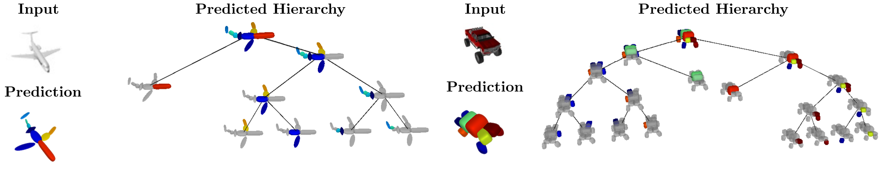

## Learning Unsupervised Hierarchical Part Decomposition of 3D Objects from a Single RGB Image

This repository contains the code that accompanies our CVPR 2020 paper
[Learning Unsupervised Hierarchical Part Decomposition of 3D Objects from a Single RGB Image](https://paschalidoud.github.io/)

Contribution
------------
Contributions such as bug fixes, bug reports, suggestions etc. are more than
welcome and should be submitted in the form of new issues and/or pull requests
on Github.

License
-------
Our code is released under the MIT license which practically allows anyone to do anything with it.
MIT license found in the LICENSE file.

Relevant Research
------------------
Below we list some papers that are relevant to our work.

**Ours:**
- Learning Unsupervised Hierarchical Part Decomposition of 3D Objects from a Single RGB Image [pdf](https://paschalidoud.github.io/)
- Superquadrics Revisited: Learning 3D Shape Parsing beyond Cuboids [pdf](https://arxiv.org/pdf/1904.09970.pdf) [blog](https://autonomousvision.github.io/superquadrics-revisited/)

**By Others:**
- Learning Shape Abstractions by Assembling Volumetric Primitives [pdf](https://arxiv.org/pdf/1612.00404.pdf)
- 3D-PRNN: Generating Shape Primitives with Recurrent Neural Networks [pdf](https://arxiv.org/abs/1708.01648.pdf)
- Im2Struct: Recovering 3D Shape Structure From a Single RGB Image [pdf](http://openaccess.thecvf.com/content_cvpr_2018/html/Niu_Im2Struct_Recovering_3D_CVPR_2018_paper.pdf)
- Learning shape templates with structured implicit functions [pdf](https://arxiv.org/abs/1904.06447)
- CvxNet: Learnable Convex Decomposition [pdf](https://arxiv.org/abs/1909.05736)

Below we also list some more papers that are more closely related to superquadrics
- Equal-Distance Sampling of Supercllipse Models [pdf](https://pdfs.semanticscholar.org/3e6f/f812b392f9eb70915b3c16e7bfbd57df379d.pdf)
- Revisiting Superquadric Fitting: A Numerically Stable Formulation [link](https://ieeexplore.ieee.org/document/8128485)
- Segmentation and Recovery of Superquadric Models using Convolutional Neural Networks [pdf](https://arxiv.org/abs/2001.10504)
